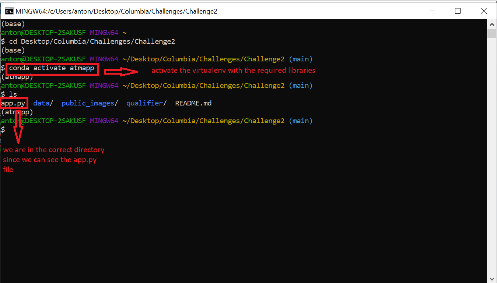
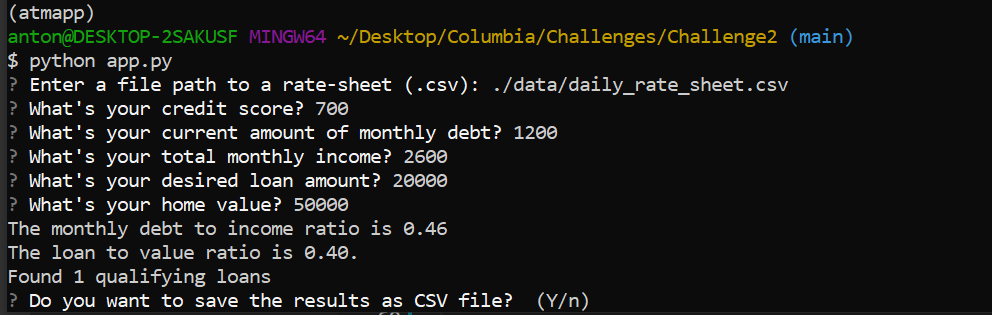
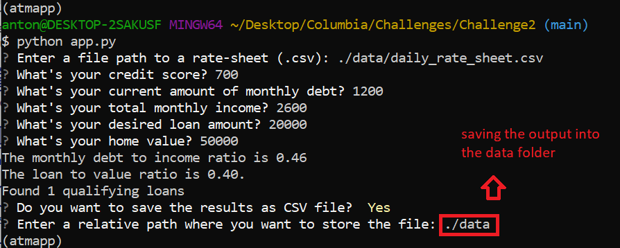

# Challenge 2 - Loan Qualifier

The Loan Qualifier is an application useful to people whom want to borrow a sum of money from a financial institution.
The goal of this app is to give the user the possibility to search within a dataset of financial institutions, in a way he can filter those matching his parameters and needs.
The application filters from the relevant database (**./data/daily_rate_sheet.csv**) the compatible lenders and give the user the possibility to save a copy of these. This usability can come in handy to all of those people who would want to ask money but they don't know to which bank to turn to.

---

## Technologies

Programming Language: **Python 3.7** 

Operative system: Windows 10 (it may be working on MAC OS and Linux too but the software was not designed on these)

Libraries:
* [fire 0.3.1](https://github.com/google/python-fire) - For CLI usage, help page and entry points
* [questionary 1.5.2](https://github.com/tmbo/questionary) - For interactive prompts and dialogs

---

## Installation Guide

Clone the present repository in your computer in a directory of choice.
Create a virtual environment where you are going to install the required library to run the program. The instructions are the following:

### Create a new virtual environment with a pre-specified version of python and Anaconda

```python
conda create -n <virtual environment name> python=3.7 anaconda
```

### Activate the virtual environment

```python
conda activate <virtual environment name>
```

### Install the required packages

```python
pip install fire == 0.3.1
```

```python
pip install questionary == 1.5.2 
```
You're all set! Now you can dive into the direcotry where `app.py` is contained and run the app with the command `python app.py`.

In this section, you should include detailed installation notes containing code blocks and screenshots.

---

## Usage

Open your Git Bash and change directory so that your working directory is the repository locally downloaded. Check out the environment you are working in as well.



Now run the command `python app.py` on your Bash; you will be asked to enter the directory for a CSV file, hence if you want to use *daily_rate_sheet.csv* already included in the program, you shall enter `./data/daily_rate_sheet.csv`, which is the relative path to the CSV file.

Now that we have a dataframe on which we will filter out the data we need, you (as the user) should enter your information regarding your financial situation (see next Figure). Once all the required data will be provided, the program will ask you if you want to save the qualifying loan that were found in a different CSV file.



I you type `n` the program will stop, while if you type `y` the program will ask you a relative path where you want to save the CSV file which will be generated under the name of *qualifying_loans.csv*. The file will be saved only if there is at least 1 qualifying loan after the analysis.



---

## Contributors

Antonio Parolini
antonio.paro96@gmail.com

---

## License

This project is licensed under the terms of the MIT license.

